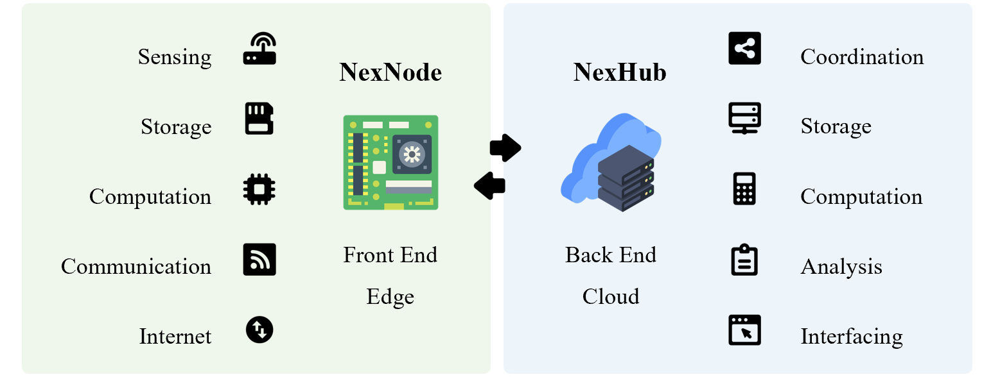

## Hi there 👋

## Links
- 🎯 Personal Website - Nextron: [www.cuishuaiwen.com](http://www.cuishuaiwen.com/) 
- 📜 Technical Blog: [www.cuishuaiwen.com:8000](http://www.cuishuaiwen.com:8000/) 

## Contact me
- 📧 E-mail: SHUAIWEN001@e.ntu.edu.sg

## Featured Projects

### Websites & Blogs

- 🚀 Website - **Shuaiwen-Cui.github.io** [https://github.com/Shuaiwen-Cui/Shuaiwen-Cui.github.io.git](https://github.com/Shuaiwen-Cui/Shuaiwen-Cui.github.io.git)
- 🚀 Tech Blog - **Infinity** [https://github.com/Shuaiwen-Cui/Infinity.git](https://github.com/Shuaiwen-Cui/Infinity.git)

### ESP STUDY

- 🚀 **ESP_STUDY** [https://github.com/Shuaiwen-Cui/ESP_STUDY.git](https://github.com/Shuaiwen-Cui/ESP_STUDY.git) | [Online Doc](https://shuaiwen-cui.github.io/ESP_STUDY/)

### Nexusia (🏗️) - General Purpose IoT System

#### I Frontend

- 🚀 **NexNode** [https://github.com/Shuaiwen-Cui/NexNode.git](https://github.com/Shuaiwen-Cui/NexNode.git) | [Online Doc](https://shuaiwen-cui.github.io/NexNode/)
- 🚀 **TinyAuton** [https://github.com/Shuaiwen-Cui/TinyAuton.git](https://github.com/Shuaiwen-Cui/TinyAuton.git) | [Online Doc](https://shuaiwen-cui.github.io/TinyAuton/)

#### II Backend

- 🚀 **NexHub** [https://github.com/Shuaiwen-Cui/NexHub.git](https://github.com/Shuaiwen-Cui/NexHub.git) | [Online Doc](https://shuaiwen-cui.github.io/NexHub/)

### LiftSHM (🏗️) - Specialized IoT System for Structural Health Monitoring

#### I Frontend

- 🚀 **LiftNode** [https://github.com/Shuaiwen-Cui/LiftNode_ESP32.git](https://github.com/Shuaiwen-Cui/LiftNode_ESP32.git) | [Onlien Doc](https://shuaiwen-cui.github.io/LiftNode_ESP32/)
- 🚀 **TinySHM**

#### II Backend

- 🚀 **LiftHub**
